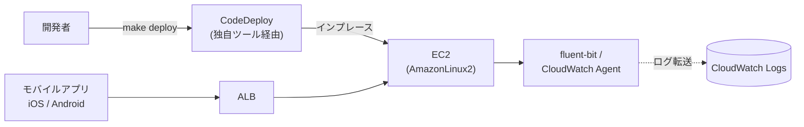
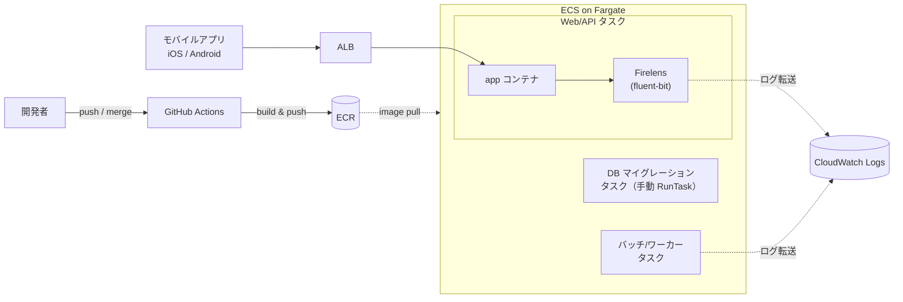
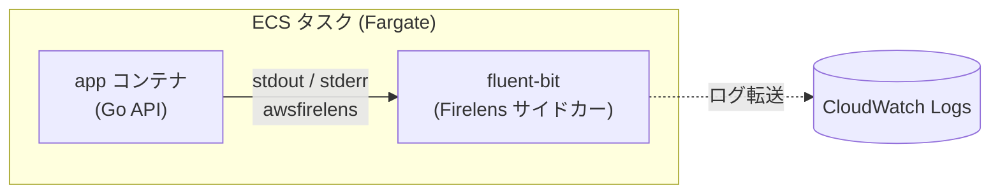
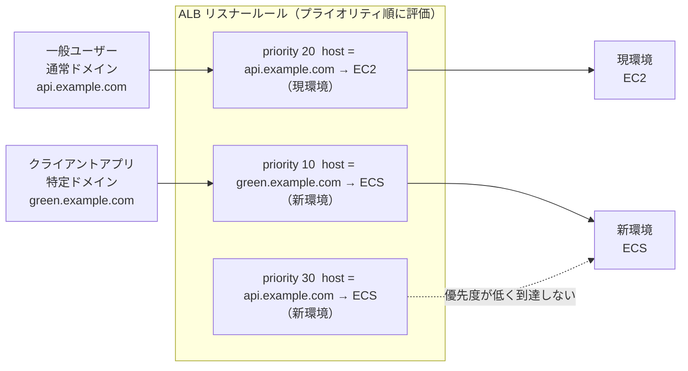

## はじめに

AmazonLinux2は2026年6月EOLを迎えるので、このタイミングで自社サービスのEC2をECS Fargateへお引越ししました。

その際の移行の流れや躓いたところ、課題に感じたところのまとめ。
移行自体を実施したのは既に半年近くも前なんですが振り返りも兼ねて。

## 移行前の構成

サーバーサイドは Go で書かれた API をChef (mitamae) でプロビジョニングしたAmazonLinux2 の EC2 上で動かしていました。インフラは CloudFormation と一部CDK で管理するというような構成。（RDSやS3は今回あまり関係ないため省略。）

サーバーへのデプロイもMakefileからCodeDeployでインプレースデプロイを実行する手動デプロイでした。

なお、このアプリは外部委託していたものを内製化した関係上、委託先会社様の独自開発ツールがたくさんあり、ドキュメントも残っておらずブラックボックスな状態でした。
~~ないものは作るというのは実にエンジニアらしくて素晴らしいと思うのですが、引き継がされた身としては勘弁してほしい~~

## EC2運用時の課題

### デプロイのアーキテクチャが複雑

インプレースデプロイのため、万一デプロイに問題があったときに直ちにロールバックができない。
また先述の通り、デプロイは全て手動で実行。さらに先人達によって作られた秘伝のタレツールで行われていた。（Makefileを実行するとなんかいい感じにCodeDeployが起動して、さらによくわからんツールがインプレースデプロイしてくれている…？🤔）

### サーバーのメンテナンス人的負荷

OSやミドルウェアのバージョン更新に割く人的な資源が足りない。（チームにはバックエンドは私含めて2人しかおらず、さらにインフラができるのが実質私一人しかいなかった。）

## 技術選定理由

今回ECS Fargateを選んだ理由はサーバーのメンテナンス人的負荷軽減です。Fargateはホストの管理をAWS側に委譲することができます。
そうすることで、OSのEOL毎に起きるマイグレーションやOSのパッチ対応、ミドルウェアの管理などのコストを削減でき、アプリケーションの開発に集中できると考えました。

もう一つの理由がデプロイ周りの改善です。コンテナイメージを差し替えるだけのシンプルなデプロイになり、新旧の環境を並行稼働させて問題があれば即座に切り戻せる。インプレースデプロイでロールバックできなかった課題もこれで解消できると考えました。

なお、他にコンテナオーケストレーションのサービスといえばEKSがありますが、今回の大きな移行の目的は運用にかかる人的コストの削減ですので、MAU30万程度で比較的シンプルなアプリではk8sのような管理コストの高いものは選外としました。

また今回CPUアーキテクチャは、armの方がx86に比べて2割程度料金が安いのでarmに変更しています。

https://aws.amazon.com/jp/fargate/pricing/

## 移行後の構成

最終的な構成は以下のようになりました。

基本的にEC2だったところがそっくりECS Fargateに置き換わった形です。EC2上で動作していたバッチ処理は、それぞれ想定実行時間に応じてECSのタスクとLambdaにそれぞれ切り出しました。

また、B/GデプロイはCodeDeployを使わず、ECSネイティブのB/G機能を採用しています。

この構成に至るまでを、以下のフェーズで進めました。

## 移行の進め方

### 移行準備(コンテナ化)

アーキテクチャの理想形は一旦置いて、既存アプリをそのままコンテナ化。ローカルで「とにかく起動して疎通する」ことを優先。
ホストOSに依存した機能が元々なかったこと、またGoという言語はシングルバイナリでマルチプラットフォームにビルドできるので、とりあえず動くものの用意だけであれば割とすんなりできました。

なお、コンテナ化といえばマイクロサービスアーキテクチャだと思っていたので、最初はとことん分割して綺麗にしてやろうと息巻いていましたが、割と早い段階でやめました。

というのも元々モノリシックアーキテクチャで設計されていること、そしてサービスの規模が小規模なので分割したところでコンテナ間通信など考えることが増えてアーキテクチャが複雑になるだけだと判断。アプリへのプッシュ通知機能など、簡単に分割できて主機能ではないものだけを分割するにとどめました。

ECSに移行できた時点でアプリの可搬性は上がっているし、運用しながらアーキテクチャを徐々に適切に実装していく方針としました。

### 開発環境での検証

ECSのクラスターを作成し、タスク定義・サービスを構築していきます。

※図はログ収集経路に絞って表示しています。実際はX-Rayなど、他のサイドカーも同居しています。

タスク定義は、アプリ本体の `app` コンテナと、ログ転送を担う `fluent-bit` コンテナを1つのタスク内に同居させるサイドカーパターンで構成しています。アプリは標準出力にログを吐くだけで、Firelens(awsfirelens ログドライバ)経由でサイドカーの fluent-bit に渡り、そこから CloudWatch Logs へ転送されます。

またコンテナは「1コンテナ1プロセス（1つの責務）」が原則で、ログ転送のような付随的な処理はアプリ本体に同梱せず、別コンテナ（サイドカー）として切り出します。こうしておくとコンテナ単位＝プロセス単位で粒度が揃うため、コンテナの状態を観測することがそのまま個々の処理の観測につながります。

デプロイ機構についてもまずはECSへの移行に焦点を当てて後回しとしました。そのため移行当初は手動でECRへコンテナイメージをプッシュ・ECSへデプロイする方式となっています。

その他、バッチ処理のLambdaとECS Tasksへのそれぞれの振り分けは15分以内で終わるものについてはLambda、それ以上かかる可能性のあるものについてはECSタスクスケジュールに切り出しています。

### ステージング環境の検証

今回の変更は原則インフラレイヤーなので、アプリケーションレイヤーは一部ParameterStoreでの環境変数の取得方法の変更などを除き、ビジネスロジックの変更はありませんでした。そのため最低限のリグレッションテストとしました。

またタスク定義のサイズ最適化も運用しながらで十分と判断し、EC2の時と同じRAMとCPUサイズを確保するだけとしました。

### 本番切り替え

※上図は切り替え前の状態。本番切り替え時は priority 20 と 30 の優先度を入れ替え、通常ドメインをECS（新環境）へ向ける。

ALBのリスナールールは priority の値が小さいものから順に評価され、最初にマッチしたルールが採用されます。

ポイントは priority 30 のルールです。新環境(ECS)は通常ドメインでもアクセスできるルール自体は持っていますが、同じ通常ドメインにマッチする priority 20 の現環境(EC2)向けルールの方が先に評価されるため、通常ドメインのリクエストは必ずEC2に吸われ、priority 30 には到達しません。結果として、新環境に届くのは priority 10 の特定ドメイン経由のアクセスだけになります。

本番では、まずECSのターゲットグループをALBに追加しつつ、通常の本番トラフィックは引き続き現環境(EC2)へ流れるようにリスナールールのプライオリティを設定しました。具体的には、新環境(ECS)向けのルールには「特定のドメインでアクセスされたときだけマッチする」条件(ホストヘッダ判定)を付け、そのドメインを知っている人だけが新環境に到達できる状態を作りました。

この状態でクライアントアプリチームに協力してもらい、本番切り替え前の新環境(ECS)に対してテストを実施しました。

問題がないことを確認できたら、 priority 20（通常ドメイン → EC2）の優先度を priority 30 より下げて（番号を大きくする）トラフィックを切り替えます。現環境(EC2)向けルールよりも 新環境(ECS)向けの通常ドメインルールの方が先に評価されるようになるため、通常ドメインのリクエストは新環境へ流れるようになり、本番トラフィックがそっくり切り替わります。このように api.example.com にマッチする2つのルールの優先度を入れ替えることで現環境と新環境の向き先を切り替え、Blue/Greenデプロイを疑似的に再現しました。

ルールの優先度の上下だけで切り替えているので、万一問題があっても優先度を元に戻すだけで即座に現環境(EC2)へ切り戻せます。

### 事後処理

ECS移行後もEC2は1ヶ月ほどは稼働させ、万一の問題があった場合にはすぐにリスナールールのプライオリティを変更することで切り替えられる状態としておきました。1ヶ月経過した時点で特に不具合の報告もありませんでしたので、退役させIaCの中からも完全に削除。

後回しにしていたGitHub ActionsでのCI/CDも実装しました。仕組みは次の通り。

1. 該当ディレクトリやDockerfileに変更があると、GitHub Actions がパスフィルタで検知する
2. イメージをビルドし、**コミットハッシュをタグ**としてECRにプッシュする
3. `cdk deploy` を実行し、ECSが参照するイメージタグをそのコミットハッシュへ更新する
4. タスク定義・サービスが更新され、新しいコンテナがデプロイされる

イメージタグにコミットハッシュを使うことで、「今動いているコンテナがどのコミットのものか」が一目で分かり、切り戻したいときも対象のタグを指定するだけで済みます。

ただ後述しますが、CDK実行時にイメージタグをコンテキストとして渡すこの方式は、インフラとアプリのレイヤーが密結合となるため失敗したなと思っています。

## 大変だったところ、失敗したところ

### Firelensの実装

EC2では fluent-bit を単体プロセスとして動かし、ログファイルをtailする構成でした。一方ECSのFirelensは各コンテナの標準出力をawsfirelens経由で受け取る方式で、入力の取り方からして別物。設定の前提が違うため、結局ゼロから書き直すことになりました。
また自身でfluent-bitのconfファイルを編集するのは初めてだったため、思った通りにフィルターやパースができず悪戦苦闘しました。

### パブリックイメージ直プルでサービス停止

ステージング環境でのテスト時にたまたまDockerHubで障害が発生。ちょうどそのタイミングでデプロイしており、ECSで利用していたコンテナイメージの一部は直接DockerHubからプルしてしまっていたため、コンテナイメージがプルできずサービスが起動できなくなってしまいました。

自身でカスタマイズしていないイメージであっても必ずECRでコンテナイメージを作成する方がよいです。そしてDockerHubは時間あたりのイメージのプル制限があるので[Amazon ECR Public Gallery](https://gallery.ecr.aws)を優先して利用するようにしました。

### インフラとアプリの密結合

先述のとおり、`cdk deploy` の時にイメージタグを渡す形式にしたのですが、結果的にインフラとアプリの密結合になってしまいました。
アプリケーションをデプロイするだけのつもりが `cdk deploy` でアプリケーションをデプロイしているため、意図しないタイミングでインフラリソースの更新がかかってしまうことがあります。現状そこまで大きな問題になっていないのでしばらくこのままにするつもりですが、[ecspresso](https://github.com/kayac/ecspresso) を使うなどして、別々でデプロイできるようにした方が無難に感じています。

## まとめ

ECS Fargateにしたおかげで単純なサーバー料金自体は微増といったところですが、人によるメンテナンスの時間が減り安全に運用ができるようになりました。
アーキテクチャの正しさや綺麗さを気にするのも結構ですが、管理・運用しやすいかの観点が必要。
また、一度に完璧を目指さずに優先順位をつけて対応すること、運用しながら徐々に改善を繰り返していくことが大切。~~DevOpsという名のタスクの後回し~~
